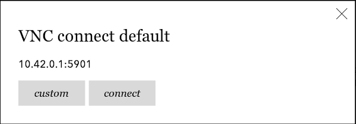

# Kobo Setup

## Installation 📦️

1. Download the latest `KoboRoot.tgz` from the Github [releases](https://github.com/ivy-rew/eink-vnc/releases) page.
2. Connect your Kobo device via USB and mount it.
3. Copy the `KoboRoot.tgz` file into the `.kobo` directory.
4. Safely unplug the device and the packet will be installed just like a Kobo software update.


## VNC Server ⌨️

Run a VNC server on the device you'd like to view on your Kobo.

I use a Linux/Ubuntu Desktop enviroment, and made the best experience with using tigervnc-server. It can be installed from with the package manager via `sudo apt install tigervnc-server`. 

To not run into scaling and size issues, we run an anonymous
VNC session:
```
vncserver -localhost no -name home -xstartup $HOME/.vnc/anonymous-vnc_xstartup -geometry 1872x1404
```

With the `geometry` flag we pass the exact resolution of your kobo reader. The example runs for an Elipsa 2E, so you may adapt for your device.

The `anonymous-xvnc_xstartup` is a file, controlling the bootstrap of the anonymous x-session. If you haven't one already, you may copy from my [example](anonymous-vnc_xstartup) that supports some popular Ubuntu window managers.

I'd test the connection to this VNC server locally, using a vncviewer: `vncviewer :1` just to make sure the X-session startup worked, before going into Kobo connection establishment.

## Network 🛜️

Your VNC Server and the Kobo device displaying it must reside in the same network in order to connect. This can be achieved by USB Network or WLAN, note though that I recommend the later due to its simplicity and performance.

### WLAN

1. Connect your Kobo device to the same WLAN, as your host that runs the VNC server.

### Speed

If you face slow updates or frequent unexpected fracturs chances are very high that your network link isn't fast enough. Reasons could be that your WLAN downgrades into 2.4 GHZ mode, since Elipsa 2E and maybe others are not built to run in 5GHZ networks.

To the rescue:

1. Use a dedicated WLAN adapter, just to connect your host and the Kobo. I use a [TP-Link Archer T3U Plus](https://www.digitec.ch/en/s1/product/tp-link-archer-t3u-plus-usb-30-network-adapters-13156781) for that matter.


### USB

Older Kobo devices have been shipped with an USB OTG driver. Therefore, its possible to connect the device via USB and let it host an additional Network connection between your host and Kobo.

Today I wouldn't recommend this path:

1. Modern devices such as Libra Colour or Elipsa 2E no longer have a bundled USB OTG network driver, and yet nobody has shared a solution how to get one.
2. The Network-Adapter changes its identity often and is therefore unstable on my other device, the H20
3. The USB port on the Kobo device wasn't built for heavy usage over days and hours, like I do with the einkvnc. It could easily brake off the board.


## Connecting 🖥️

The VNC client on the Kobo device can be conveniently launched via NickelMenu. Look for the entry called `VNC run`. 

Install the following extensions if you can't launch or see the menu yet. The installation process is the same as for the main einkvnc component:
1. [NickelMenu](https://www.mobileread.com/forums/showthread.php?t=329525) to supply the custom launcher
2. [NickelDBus](https://shermp.github.io/NickelDBus/) dialog framework support


### Default Client

The connection dialog comes with an option to connect quickly 
using the default-client.



This default client can be configured under [.adds/einkvnc/default_client.sh](../nickel/default_client.sh).
Just edit the IP, port & password to define your favourite vncserver
and you are good to consent the connection dialog question
to use the default client.

### SSH Alternative

You can use this tool by connecting to the eInk device through SSH, instead of using menu launchers on the device itself.

To connect to a VNC server:

``` shell
./einkvnc [IP_ADDRESS] [OPTIONS]
```

For example:

``` shell
./einkvnc 192.168.2.1 --port 5902 --password abcdefg123 --contrast 2 
```

### Dedicated ✍️

To run without any disturbing updates from the still running Kobo eReader 
you may kill the running Kobo software by running the `./kill_nickel.sh` in the einkvnc dir. 

This comes with the benefit that the Stylus Pen interactions are
only consumed by einkvnc, and therefore work better. 
Especially the "manual-refresh", which is triggered by double-tapping with the eraser of the pen, 
will only work if there is no concurrent Kobo software running.

In order to go back into the Kobo default software
after you are done with VNC, 
I recommend to restart the device trough a `reboot` command.
